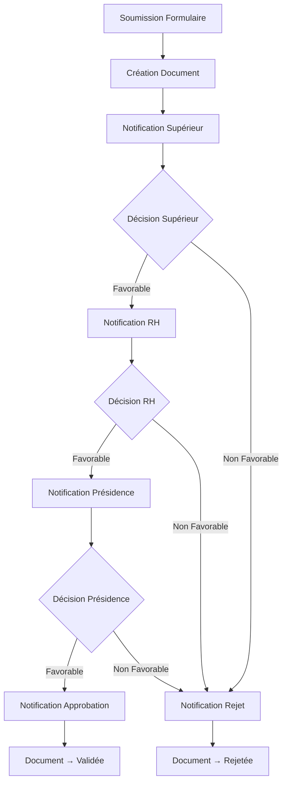

# Système de Gestion des Autorisations d'Absence

Ce script Google Apps Script permet d'automatiser le processus de demande et de validation des autorisations d'absence au sein d'une organisation avec une architecture modulaire et sécurisée.

## 🚀 Fonctionnalités

- **Traitement automatique** des soumissions de formulaire Google Forms
- **Flux de validation en cascade** (Supérieur Hiérarchique → RH → Présidence)
- **Génération automatique de documents** basés sur un modèle avec placeholders
- **Organisation intelligente des fichiers** dans Google Drive (par année, employé, et statut)
- **Notifications email professionnelles** avec boutons d'action
- **Protection avancée** des décisions et de la feuille de calcul
- **Métadonnées automatiques** en arrière-plan (invisibles à l'utilisateur)
- **Traçabilité complète** avec journalisation détaillée

## 📋 Prérequis

- Formulaire Google Forms pour les demandes d'absence
- Feuille de calcul Google Sheets liée au formulaire
- Document modèle Google Docs avec placeholders
- Structure de dossiers Google Drive

## 🏗️ Architecture du Code

Le système est organisé en **3 fichiers modulaires** pour une maintenance facile :

### 📁 **Config.gs** - Configuration et utilitaires
- Configuration centralisée (emails, dossiers)
- Fonctions utilitaires réutilisables
- Gestion de la protection de la feuille
- Gestion des documents et dossiers

### 📧 **EmailService.gs** - Gestion des emails
- Service orienté objet pour les notifications
- Templates d'emails professionnels avec signatures
- Gestion de la chaîne de validation
- Fonctions de compatibilité

### ⚙️ **Main.gs** - Workflow principal
- Traitement des soumissions de formulaire
- Logique de validation et approbation
- Gestion des rejets et approbations
- Fonction d'initialisation

## ⚙️ Configuration

### 1. Configuration des emails et dossiers

Dans **Config.gs**, modifiez la section CONFIG :

```javascript
const CONFIG = {
  emails: {
    rh: "rh@entreprise.com",                    // Email du service RH
    presidence: ["president@entreprise.com", "directeur@entreprise.com"] // Emails présidence (2 max)
  },
  folders: {
    mainId: "VOTRE_ID_DOSSIER_PRINCIPAL",      // ID dossier principal Google Drive
    employeeId: "VOTRE_ID_DOSSIER_EMPLOYES",   // ID dossier des employés
    templateId: "VOTRE_ID_TEMPLATE_DOCUMENT"   // ID du document modèle
  }
};
```

### 2. Personnalisation des signatures email

Dans **EmailService.gs**, modifiez la fonction `getSignatures()` :

```javascript
validation: `
  <div style="margin-top: 20px; padding-top: 15px; border-top: 1px solid #e0e0e0;">
    <p style="margin: 5px 0; color: #666; font-size: 13px;">
      <strong>VOTRE ENTREPRISE</strong><br>
      Service Ressources Humaines<br>
      📧 rh@votre-entreprise.com | 📞 +XXX XX XXX XX XX<br>
      🏢 Votre adresse
    </p>
  </div>
`
```

## 📄 Structure du Document Modèle

Le document modèle doit contenir ces placeholders :

**Informations employé :**
- `{{matricule}}`, `{{nom}}`, `{{prenom}}`
- `{{serviceFonction}}`

**Détails de l'absence :**
- `{{typeAbsence}}`, `{{dateDebut}}`, `{{heureDebut}}`
- `{{dateFin}}`, `{{heureFin}}`, `{{nbreJours}}`
- `{{motifAbsence}}`, `{{typePermission}}`, `{{motifPermission}}`

**Statuts de validation :**
- `{{statusSuperieurHierarchique}}`
- `{{statusRH}}`
- `{{statusPresidence}}`

## 📊 Structure de la Feuille de Calcul

| Colonne | Contenu | Description |
|---------|---------|-------------|
| A-P (1-16) | Données formulaire | Informations saisies par l'employé |
| Q (17) | Validation Supérieur | "Favorable" ou "Non Favorable" |
| R (18) | Validation RH | "Favorable" ou "Non Favorable" |
| S (19) | Validation Présidence | "Favorable" ou "Non Favorable" |
| T (20) | Commentaire Présidence | Commentaire optionnel |
| U-Y (21-25) | **Métadonnées cachées** | ID document, emails, timestamps |

> **Note :** Seules les colonnes Q, R, S sont modifiables par les utilisateurs.

## 📁 Organisation Automatique des Dossiers

```
Dossier Principal
└── Dossier des Employés
    └── Autorisation d'absence - [ANNÉE]
        └── [PRÉNOM NOM]
            ├── En Attente/     (demandes en cours)
            ├── Validée/        (demandes approuvées)
            └── Rejetée/        (demandes refusées)
```

## 🔧 Déploiement

### 1. Installation du Code

1. Ouvrez votre feuille Google Sheets
2. **Extensions** > **Apps Script**
3. Supprimez le fichier `Code.gs` par défaut
4. Créez **3 nouveaux fichiers** :
   - `Config.gs` - Copiez le contenu de Config.gs
   - `EmailService.gs` - Copiez le contenu de EmailService.gs
   - `Main.gs` - Copiez le contenu de Main.gs

### 2. Configuration Initiale

1. **Remplissez** la configuration dans `Config.gs`
2. **Personnalisez** les signatures dans `EmailService.gs`
3. **Sauvegardez** tous les fichiers

### 3. Initialisation du Système

Exécutez **une seule fois** la fonction d'initialisation :

```javascript
// Dans l'éditeur Apps Script, sélectionnez cette fonction et cliquez sur "Exécuter"
initializeSystem();
```

Cette fonction configure automatiquement :
- ✅ Protection de la feuille (seules colonnes Q,R,S modifiables)
- ✅ Triggers pour les événements (soumission formulaire, modification feuille)
- ✅ Permissions et sécurité

### 4. Configuration des Triggers (Automatique)

Les triggers sont créés automatiquement par `initializeSystem()` :
- **onFormSubmit** : Traite les nouvelles demandes
- **onEditValidation** : Gère les validations dans les colonnes Q,R,S

## 🔄 Processus de Validation



## 📧 Types d'Emails Envoyés

### Pour les Validateurs
- **Sujet :** "Validation requise - Demande d'absence de [Nom]"
- **Contenu :** Lien vers document + bouton "Décider"
- **Signature :** Professionnelle avec coordonnées

### Pour les Demandeurs
- **Confirmation :** "Bonjour [Prénom], votre demande a été soumise"
- **Approbation :** "Bonjour [Prénom], votre demande est approuvée"
- **Rejet :** "Bonjour [Prénom], votre demande est refusée"

## 🛡️ Sécurité et Protection

### Protection de la Feuille
- **Feuille entièrement protégée** sauf colonnes de validation
- **Seules Q, R, S** modifiables par les utilisateurs
- **Cellules protégées** après validation (pas de modification possible)

### Validation en Cascade
- **Ordre strict :** Supérieur → RH → Présidence
- **Blocage automatique** si ordre non respecté
- **Statuts autorisés :** "Favorable" ou "Non Favorable" uniquement

### Métadonnées Sécurisées
- **Colonnes U-Y cachées** contiennent les données système
- **IDs documents**, emails, timestamps automatiques
- **Invisible** pour les utilisateurs finaux

## 🔍 Débogage et Maintenance

### Logs Détaillés
Consultez les logs via **Extensions** > **Apps Script** > **Exécutions** :
- `[FORMULAIRE]` - Traitement des soumissions
- `[EMAIL ENVOYÉ]` - Confirmations d'envoi
- `[VALIDATION]` - Actions de validation
- `[ERREUR]` - Problèmes rencontrés

### Problèmes Courants

| Problème | Solution |
|----------|----------|
| Emails non reçus | Vérifier CONFIG.emails et quotas Gmail |
| Erreur permissions | Vérifier accès aux dossiers Google Drive |
| Validation bloquée | Vérifier ordre : Supérieur → RH → Présidence |
| Document non créé | Vérifier ID du template dans CONFIG |

## 🎨 Personnalisation

### Modifier les Messages d'Email
Éditez la fonction `createProfessionalEmail()` dans **EmailService.gs**

### Ajouter un Niveau de Validation
1. Ajouter une colonne dans la feuille
2. Modifier `checkValidationOrder()` dans **Main.gs**
3. Mettre à jour `notifyNextValidator()` dans **EmailService.gs**

### Changer les Statuts de Validation
Rechercher "Favorable" et "Non Favorable" dans le code pour les remplacer

## 📈 Limitations

- **Quotas Google Apps Script** : 6 minutes d'exécution max, limite d'emails/jour
- **Validation séquentielle** : Ordre strict obligatoire
- **Décisions définitives** : Pas de modification après validation
- **Un seul template** : Document modèle unique pour toutes les demandes

## 🆕 Nouveautés de cette Version README(l 249)

### ✅ Architecture Modulaire
- Code séparé en 3 fichiers spécialisés
- Maintenance facilitée pour développeurs

### ✅ Emails Professionnels
- Templates avec signatures personnalisables
- Boutons d'action intégrés
- Messages adaptés au contexte

### ✅ Sécurité Renforcée
- Protection ciblée de la feuille
- Métadonnées invisibles
- Validation stricte des données

### ✅ Automatisation Complète
- Configuration en une fois
- Triggers automatiques
- Pas d'intervention manuelle

## 📞 Support

Pour des modifications avancées ou du support, consultez :
- **Logs d'exécution** dans Apps Script
- **Documentation Google Apps Script**
- **Code source commenté** pour comprendre la logique

---

*Système développé pour automatiser et sécuriser la gestion des absences avec Google Workspace.*
